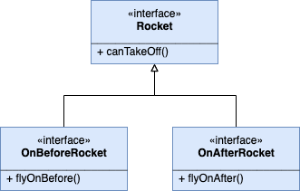
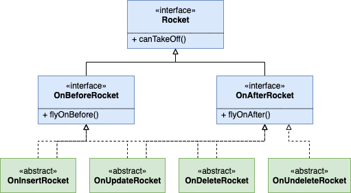

# Apex Propellant

An _Elegant Object_ oriented alternative solution for Apex trigger handling. It's not rocket science, I promise.

```
       ^
      / \
     /___\
    |=   =|
    |  _  |
    | (_) |
    |  _  |
    | (_) |
   /|     |\
  / |=   =| \
 /  |##!##|  \
|  /|##!##|\  |
| / |##!##| \ |
|/   ^ | ^   \|
     ( | )
    ((   ))
   (( pro ))
   (( pel ))
   (( lan ))
    (( t ))
     (( ))
      ( )
       .
       .
```

**Deploy to SFDX Scratch Org:**
[](https://deploy-to-sfdx.com)

**Deploy to Salesforce Org:**
[](https://githubsfdeploy.herokuapp.com/?owner=berardo&repo=apex-propellant&ref=master)

## Overview

It's well known that triggers should be logicless, which means we should avoid coding directly within them. Instead, it's advisable to make calls to business classes not rarely called trigger handlers.

However, what's commonly overlooked is the dependency from the handler back to the Apex `Trigger` object.

The Apex Propellant library is inspired by a popular solution called [`TriggerHandler`](https://github.com/kevinohara80/sfdc-trigger-framework), a common generic class that can be extended to override methods like `beforeInsert()` or `afterUpdate()`, so that these methods are executed when triggers call something like:

```java
new MyBeautifulClassThatExtendsTriggerHandler().run();
```

However, while I agree this is an easy way to shift complex logics away from triggers, it doesn't bring much benefit as the handler still needs to deal with `Trigger.new`, `Trigger.old` and so on. This unwated dependency makes handler as not unit testable as triggers themselves.

On the other hand, **Apex Propellant** is a simple alternative targeting the same goal but also:

- Decoupling handlers from triggers and `System.Trigger`, allowing them to be tested in isolation
- Promoting an easy, truly object oriented API
- Promoting the usage of [immutable objects](https://en.wikipedia.org/wiki/Immutable_object)
- Giving you control over handler call repetitions and bypasses

## How it works

The intention is to make the analogy speak for itself.
You have a trigger and you aim to get your rocket code flying around the space every time your trigger is ... triggered.

That being said, as a real-world rocket, when your code takes off, it should not care about anything that was left off on the ground. All the data that you need to decide what to do and where to go should be there with you.

### Show me the code!

First things first, create a trigger and build your rocket:

```java
trigger AccountTrigger on Account(before insert) {
  OnBeforeRocket rocket = new MyAmazingRocket();
}
```

In order to reach the stars, you also need a Propellant, which is the fuel and artifact used to reach what's called the [_Escape Velocity_](https://en.wikipedia.org/wiki/Escape_velocity). Therefore, your very next step is to build a `Propellant` object then fire it.

```java
trigger AccountTrigger on Account(before insert) {
  OnBeforeRocket rocket = new MyAmazingRocket(); // 5, 4, 3, 2, 1 ...
  new Propellant(rocket).fireOff(); // Can you hear the sound? 🚀
}
```

### What should my rocket look like?

The bare minimum code you write to make the trigger above thrust your rocket up in the space is like below:

```java
public class MyAmazingRocket extends OnInsertRocket {
  public override void flyOnBefore() {
    System.debug('Yay, my 🚀 has gone through the ⛅️ on its way to the ✨');
  }
}
```

The `OnInsertRocket` is an abstract class that implements the two important interfaces `OnBeforeRocket` and `OnAfterRocket` but leave them alone for now.

The `flyOnBefore()` method is the only one called here because your trigger is `before insert` only. Propellant knows that and handles that for you, don't worry.

Would that mean I could have done `flyOnAfter()` and expect it to fly on `after trigger`?

Hey, you're smart! ... and you're right!

Alternatively, you could do this:

```java
public class MyAmazingRocket implements OnBeforeRocket {
  public void flyOnBefore() {
    System.debug('Yay, my 🚀 has gone through the ⛅️ on its way to the ✨');
  }
  public Boolean canTakeOff(TriggerOperation triggerWhen, Propellant propellant) {
    return true;
  }
}
```

Like I said before, even though the previous example introduced an abstract class, you ended up writing slightly less than now.

In order to fly on `before insert` trigger, your rocket only needs to implement `OnBeforeRocket`, which requires you to implement your proper flight (`flyOnBefore`) and another method that I'm gonna explain on the next section. Bear with me!

You might be asking (btw, you ask a lot, I like that 😍!), what about `after insert`?

Easy:

```java
public class MyAmazingRocket implements OnAfterRocket {
  public void flyOnAfter() {
    System.debug('Yay, my 🚀 is reaching the 🌚');
  }
  public Boolean canTakeOff(TriggerOperation triggerWhen, Propellant propellant) {
    return true;
  }
}
```

I know, I know ... you can have both:

```java
public class MyAmazingRocket implements OnAfterRocket {
  public void flyOnBefore() {
    System.debug('Yay, my 🚀 has gone through the ⛅️ on its way to the ✨');
  }
  public void flyOnAfter() {
    System.debug('Yay, my 🚀 is reaching the 🌚');
  }
  public Boolean canTakeOff(TriggerOperation triggerWhen, Propellant propellant) {
    return true;
  }
}
```

There's only one little thing to change when your rocket wants to take off twice in a single transaction (on before and on after triggers), you need to let `Propellant` know. Again, it's so easy:

```java
trigger AccountTrigger on Account(before insert, after insert) {
  OnBeforeRocket rocket = new MyAmazingRocket(); // 5, 4, 3, 2, 1 ...
  new Propellant(rocket, rocket).fireOff(); // Can you hear the sound? 🚀
}
```

If you didn't spot the difference, now we passed the same rocket instance twice.

I think you got the point. So let's move on to the Rocket hierarchy and finally expain the little `canTakeOff` kid.

## The Rocket Hierarchy

There's one generic interface called `Rocket` that exposes what every rocket needs to do. Fortunatelly it's just one single method:

```java
public interface Rocket {
  Boolean canTakeOff(TriggerOperation triggerWhen, Propellant propellant);
}

```

`canTakeOff` gives you the hability to decide whether your rocket will fly or not. The `Propellant` object always asks whether your rocket is ready or not and passes a `System.TriggerOperation` representing the trigger moment, and also its own state in case you need it (we'll see more on this further down when we discuss the rocket `Tank`).

On the trigger example above, `Propellant` would run something like this: `rocket.canTakeOff(TriggerOperation.BEFORE_INSERT, this);` and would move on only if this call returns `true`.

But what about the two methods (`flyOnBefore` and `flyOnAfter`)?
They come from respectively two subinterfaces of `Rocket`: `OnBeforeRocket` and `OnAfterRocket`.



You see? That's where those methods come from.

As you can imagine, the class `OnInsertRocket`, used on the very first implementation example, has `canTakeOff` already implemented for you, giving the propeller green light to fire it off on `BEFORE_INSERT`. So that, if the trigger is for example `before insert, after insert, before update`, subclassing `OnInsertRocket`, would leave your rocket on the ground when the targeted record is being updated. Makes sense, right?

Conversely, when you directly implement the two interfaces, there's no Insert/Update/Delete/Undelete context involved. You're free to decide. Can you now see why `canTakeOff` receives a `TriggerOperation`?

### Abstract classes

There are four abstract classes that implement the two `Rocket` interfaces to allow rockets to fly on all trigger operations.

The image below presents those classes so feel free to extend them to create your own rockets.



The table below summarises what operations are achieved by what classes.

| Operation  | TriggerOperations | Rocket class       | Rocket Interface |
| ---------- | ----------------- | ------------------ | ---------------- |
| `insert`   | `BEFORE_INSERT`   | `OnInsertRocket`   | OnBeforeRocket   |
|            | `AFTER_INSERT`    |                    | OnAfterRocket    |
| `update`   | `BEFORE_UPDATE`   | `OnUpdateRocket`   | OnBeforeRocket   |
|            | `AFTER_UPDATE`    |                    | OnAfterRocket    |
| `delete`   | `BEFORE_DELETE`   | `OnDeleteRocket`   | OnBeforeRocket   |
|            | `AFTER_DELETE`    |                    | OnAfterRocket    |
| `undelete` | `AFTER_UNDELETE`  | `OnUndeleteRocket` | OnAfterRocket    |

Before and after operations are always part of the same transaction, hence making them behaviour of the same object makes total sense most of the time. However, there's nothing stopping you from having two separate classes and fire two completely distinct rockets.

When it comes to DML operations though, the likelyhood of having one single object handling operations across four distinct operations is arguably lower. I've witnessed fairly common applications of _TriggerHandler_ with a clear problem of separation of concerns as it all starts from a class where you are able to override methods for all DML operations, which is rarely applicable.

That being said, what's not rare is the fair intention to run the exact same behaviour across different DML operations, like `before insert, before update`, for example. If this is your case, unfortunately you cannot extend two classes, so the main interfaces are your best friends.

## Trigger Payload

You might be missing the collections of saved or deleted records found in `Trigger.new`, `Trigger.old`, `Trigger.newMap`, and `Trigger.oldMap`. Well, when you directly implement the interfaces, it's totally up to you. But when you extend an abstract class, you can pass them up through its constructor, like below:

```java
public class MyAmazingRocket extends OnInsertRocket {
  public MyAmazingRocket(Set<SObject> newSet) {
    super(newSet);
  }
  public override void flyOnBefore() {
    System.debug('Yay, my 🚀 has gone through the ⛅️ on its way to the ✨');
    System.debug('See my first record ID: ' + this.newSet.get(0).Id);
  }
}
```

Once you pass the argument through `super(newSet)`, you can retrive the information back using the internal attribute `newSet`.

- Using `super(Set<SObject>)` you have `this.newSet`
- Using `super(Set<SObject>, Set<SObject)` you have respectively `this.newSet` and `this.oldSet`
- Using `super(Map<ID, SObject>)` you have `this.newMap`
- Using `super(Map<ID, SObject>, Map<ID, SObject>)` you have respectively `this.newMap` and `this.oldMap`

Of course you need to set everything up on your trigger:

```java
trigger AccountTrigger on Account(before insert) {
  OnBeforeRocket rocket = new MyAmazingRocket(Trigger.new); // 5, 4, 3, 2, 1 ...
  new Propellant(rocket).fireOff(); // Can you hear the sound? 🚀
}
```

Although it might seem I left this burden on your shoulders, as I could have accessed `Trigger.*` within the abstract classes, I can't stress enough how bad this practice would be. Think on a rocket taking off hooked to an anchor left on the ground.

New and old sets and maps belong to the trigger, and having an object with explicit dependency on `System.Trigger` makes it completely not unit testable as the only way to have something like `Trigger.new` populated it by saving a record.

**Remember:** Every time you need to store data before testing your code, you are **NOT** unit testing, you are actually running an integration test. Moreover, despite the importance of integration tests, you code should always be tested in isolation, which is the soul of unit tests.

## Propellant's Tank

The `Propellant` object also accepts an argument of type `Tank`, which comprises two integers, `capacity` and `consumed`. The former accepts any number to represent the tank's capacity and defaults to `5`, the latter obviously represents how much of the capacity has been already consumed and defaults to `0`.

```java
trigger AccountTrigger on Account(before insert) {
  Tank tank = new Tank(); // the same as new Tank(5) or new Tank(5, 0);
  OnBeforeRocket rocket = new MyAmazingRocket(Trigger.new); // 5, 4, 3, 2, 1 ...
  new Propellant(rocket, tank).fireOff(); // Can you hear the sound? 🚀
}
```

`new Propellant(...).fireOff()` needs to perform some checks:

- Am I being called on a trigger execution context?
- Am I launching a rocket for the appropriate operation?
- Does my rocket return true via `canTakeOff`? And here `propellant.tank` can be acessed!

Having those questions cleared, and after running the rocket's flight method, Propellant also runs `tank.consume()`, which either returns another `Tank` instance with an incremented `consumed` state or raises an `EmptyTankException` when the `consumed` amount reaches its `capacity`. Finally, `fireOff()` returns a new `Propellant` instance with the existing rockets and the more consumed instance of its tank.

## Immutability

One of beauties of object oriented programming is the hability to combine objects as living things, i.e. not only cold data structures, with the predictability of state immutability.

That means, objects should avoid changing their state during the course of their "lives".

And that's what happens to this Apex Propellant library. For instance, you cannot change a `Tank`'s state like below:

```java
Tank t = new Tank(); // t.capacity = 5, t.consumed = 0
t.consumed = 1; // It doesn't work as consumed setter is private
t.capacity = 10; // It also doesn't. Same reason
t.setConsumed(2); // It doesn't exist
t.setCapacity(8); // Neither does it
```

But what's the problem with that? The problem is called temporal coupling, which is when one can never guarantee what the object state is when it's shared with others.

```java
Tank t1 = new Tank(); // capacity is 5
Tank t2 = new Tank(10); // capacity is 10
SomewhereElse.doSomething(t1, t2);
// If Tank was mutable, this would no longer be guaranteed
System.assert(5, t1.capacity, 'The expected capacity is 5');
System.assert(10, t1.capacity, 'The expected capacity is 10');
```

As `Tank` is immutable (it also applies to `Propellant`, and I encourage you to do the same with your rockets), the code above is always guaranteed.

Rather than changing the internal `consumed` state, `Tank.consume()` return another `Tank` instance with the mentioned attribute modified. When you call `Propellant.fireOff()` you should expect to have another `Propellant` state with the +1 consumed `Tank`.

